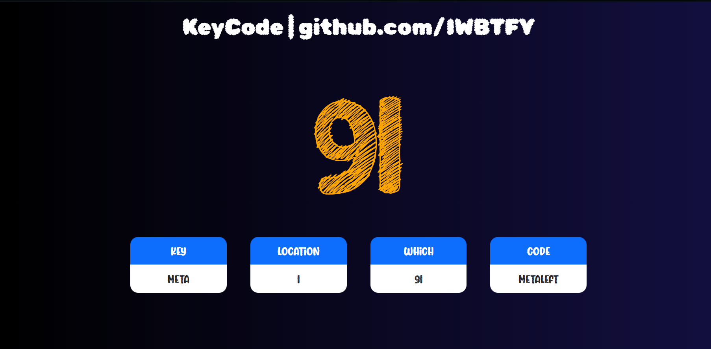

# **Key Logger for web**

### Instantly without page refresh get logs that you need from pressing keys down with " Key Logger " and save time ⏱️
### Check  it live [here](https://iwbtfy.github.io/KeyCode/). 
---

## KeyLogger feature are :

- ### Fast and quick.
- ### Requires no refresh.
- ### easy to use
- ### Shows ascii key | code | location | what you have pressed instantly .
- ### Also has cool design **...** 😎

---

### Generally it was quick practice for JS.

### Please use it to imporove yours as well if not I hope it may give you ideas or inspire you.

### Thanks for checking it out make sure to give it a star and fork it to use later. 🥰🍷

---

---

# Design Images for web:

